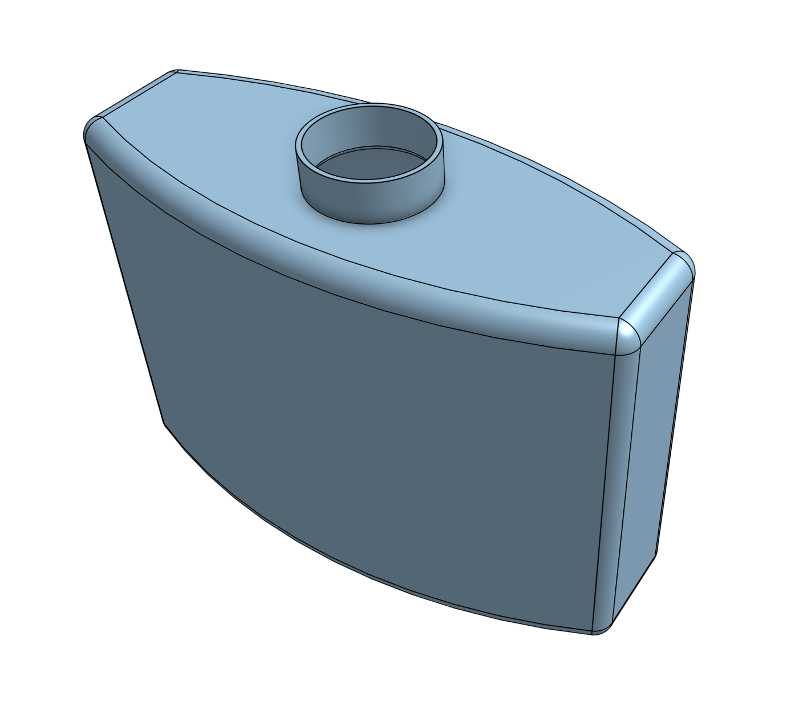

Bottle
======

This is reimplementation of the `Bottle tutorial <bottle_tut>`_ from OpenCasdade reference manual.
The `python version <python_bottle_tut>`_ of the same tutorial using `pythonocc-core`_ for your reference.

In this tutorial, we will build a model of this bottle:

1. We first define some parameters:

   .. code::
   
      HEIGHT = 50
      WIDTH = 70
      THICKNESS = 30

2. To build the body, we will need to define the bottom face first.

   The following code will create three ``segments`` - two straight and one curved side.

   .. code::

      pt1 = Point(-WIDTH / 2., 0, 0)
      pt2 = Point(-WIDTH / 2., -THICKNESS / 4., 0)
      pt3 = Point(0, -THICKNESS / 2., 0)
      pt4 = Point(WIDTH / 2., -THICKNESS / 4., 0)
      pt5 = Point(WIDTH / 2., 0, 0)

      arc = ArcOfCircle(pt2, pt3, pt4)
      segment1 = Segment(pt1, pt2)
      segment2 = Segment(pt4, pt5)

   .. image:: pics/bottom-face-sketch-half.png

   Then, we convert the segments into ``edges``

   .. code::

      edge1 = Edge(segment1)
      edge2 = Edge(arc)
      edge3 = Edge(segment2)

   Now, we connect the edges into a ``wire``, so we can work with it as with a single piece of geometry.

   .. code::

      wire = Wire([edge1, edge2, edge3])

   Next, we mirror the wire by the x-axis.
   To do that, we create an ``x_axis`` variable that will represent the x-axis.
   Then, we call ``mirror`` method on the wire to get the ``mirrored_wire``.

   .. code::

      x_axis = Geometry.OX()
      mirrored_wire = wire.mirror(x_axis)

   To build the bottom face, we join the 2 wires into a one.

   .. code::

      wire_profile = Wire([wire, mirrored_wire])

   And then, we build a ``face`` from the wire.

   .. code::

      face_profile = Face(wire_profile)

   .. image:: pics/bottom-face-sketch.png

   Now that we have the face, we can extrude it using the ``extrude`` method.
   We will need a ``vector`` to define the direction of extrusion.

   .. code::

      prism_vec = Vector(0, 0, HEIGHT)
      body = face_profile.extrude(prism_vec)

   In the next step, we will apply a ``fillet`` to get the rounded edges.
   To do that we get all the edged via ``edges`` method.
   And then, we call the ``fillet`` method with the list of edges and the radius of the fillet.

   .. code::

      edges = body.edges()
      body = body.fillet(edges, THICKNESS / 12.0)

   .. image:: pics/body-fillet.png

3. In this next step, we build the neck of the bottle.
   We do that by creating a cylinder that will sit on top of the body.

   .. code::

      neck_location = Point(0, 0, HEIGHT)
      neck_axis = Geometry.DZ()
      neck_ax2 = Axis2(neck_location, neck_axis)

      neck_radius = THICKNESS / 4.
      neck_height = HEIGHT / 10
      neck = Cylinder(neck_ax2, neck_radius, neck_height)

   Then, we simply join the neck with the body using the ``fuse()`` method.

   .. code::

      body = body.fuse(neck)

   .. image:: pics/body-w-neck.png

4. In the last step, we hollow out the body.

   For that, we will need to find the top face of the neck.
   This face will be removed to create the top opening.
   We can achieve this with the following simple code:

   .. code::

      z_max = -1.
      top_face = None
      for face in body.faces():
          if face.is_plane():
              plane = face.plane()
              if plane.location.z > z_max:
                  z_max = plane.location.z
                  top_face = face

   To hollow out the body we call the ``hollow`` method with the faces we want to remove, thickness and tolerance.

   .. code::

      body = body.hollow([top_face], -THICKNESS / 50, 1e-3)

5.  This last segment is specific to ``figura`` and is not part of the original tutorial.
    This is the way how we tell the code which shapes should be exported into the output file.

    .. code::

       export = [body]

The complete script is:

.. literalinclude:: ../../tutorials/bottle/bottle.py

.. _bottle_tut: https://dev.opencascade.org/doc/overview/html/occt__tutorial.html
.. _python_bottle_tut: https://github.com/tpaviot/pythonocc-core/blob/master/test/test_mypy_classic_occ_bottle.py
.. _pythonocc-core: https://github.com/tpaviot/pythonocc-core
